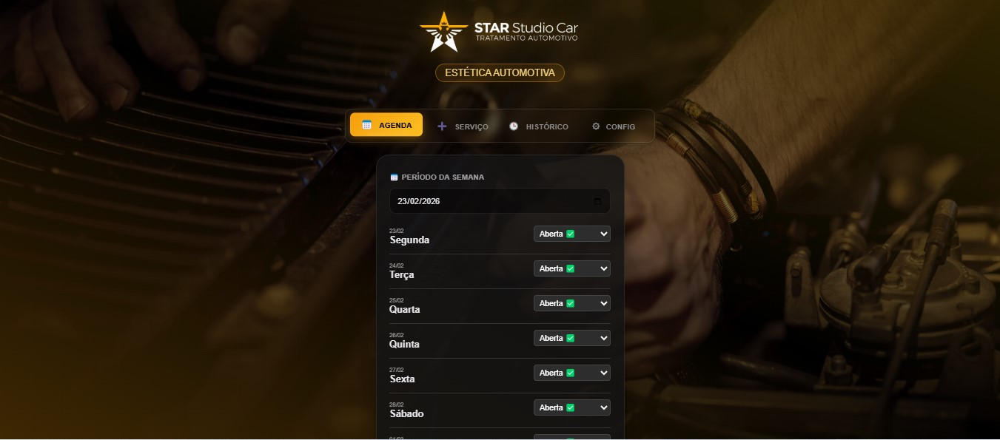
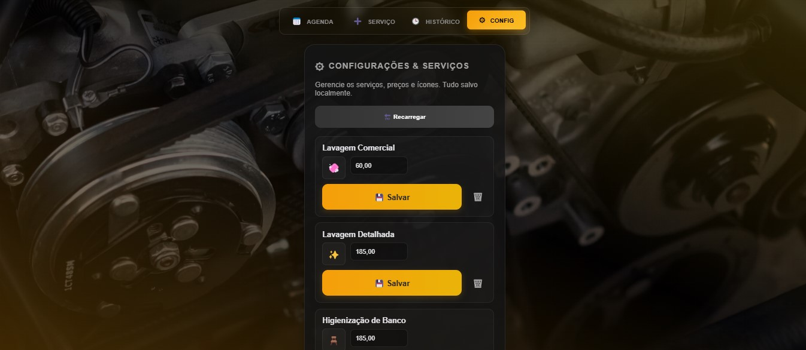
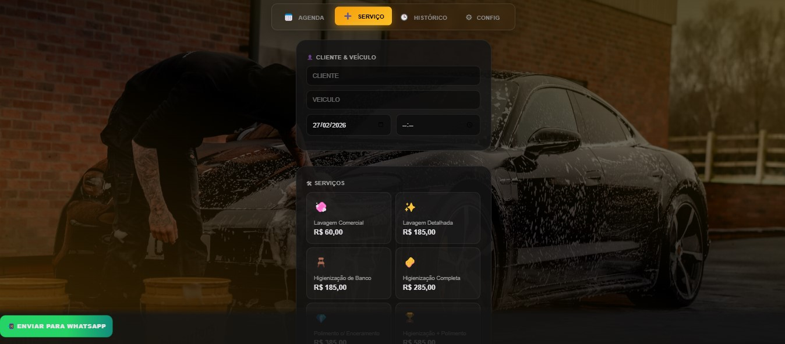
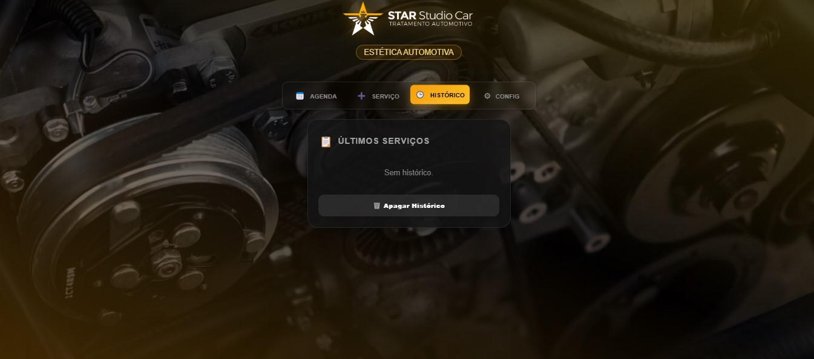

# 🚗 STAR STUDIO CAR - Sistema de Gestão de Serviços Automotivos

Sistema completo para gerenciamento de serviços automotivos, agendamentos, orçamentos e comunicação com clientes via WhatsApp.

**🌐 Demo Online:** [https://luiscadeira.github.io/Star/](https://luiscadeira.github.io/Star/)

---

## 📋 Sobre o Projeto

O **STAR STUDIO CAR** é uma aplicação web moderna desenvolvida para facilitar a gestão de serviços de estética automotiva. O sistema oferece ferramentas para:

- ✅ Criação rápida de orçamentos personalizados
- 📅 Agendamento semanal de serviços
- 📊 Histórico completo de atendimentos
- 💬 Comunicação automatizada via WhatsApp
- ⚙️ Configuração flexível de serviços e preços
- 📝 Controle de vistorias e observações
- 📱 Progressive Web App (PWA) instalável
- 🔄 Sincronização de dados com servidor
- 🎨 Interface moderna com Glassmorphism

---

## 🎯 Funcionalidades Principais

### 1️⃣ **Novo Serviço**

Interface completa para criação de orçamentos e agendamentos:

- Cadastro de cliente e veículo.
- Seleção de serviços com preços configuráveis.
- Geração automática de mensagens para WhatsApp (Agendamento e Aviso de Pronto).
- Cálculo automático do valor total e salvamento no histórico.

### 2️⃣ **Agenda Semanal**

Controle visual da disponibilidade:

- Visualização de segunda a domingo.
- Status personalizados (Aberta, Reservado, A confirmar).
- Compartilhamento da agenda formatada via WhatsApp.

### 3️⃣ **Histórico de Serviços**

- Lista de todos os serviços cadastrados.
- Informações de placa, cliente, data e valor.
- Botão rápido para enviar aviso de "Pronto" via WhatsApp.

### 4️⃣ **Configurações**

- Gerenciamento de serviços, preços e ícones.
- Tudo salvo localmente ou sincronizado com o servidor.

---

## 🛠 Tecnologias Utilizadas

- **Frontend:** HTML5, CSS3 (Glassmorphism), JavaScript (Vanilla)
- **Persistência:** LocalStorage (Cliente) e PHP/JSON (Servidor)
- **PWA:** Service Worker com cache offline, instalável como app
- **Integrações:** WhatsApp API e Google Maps
- **Framework:** Bootstrap 5.1.3 (CDN)
- **Cache:** Service Worker com estratégia de cache inteligente

---

## 🚀 Como Instalar e Publicar

### 1. Uso Local (Windows/WAMP)

1. Copie a pasta para `c:\wamp64\www\starstudio`

2. Acesse `http://localhost/starstudio` no seu navegador

### 2. Publicar no GitHub Pages

O projeto está configurado e otimizado para GitHub Pages:

1. Crie um repositório no GitHub

2. Faça o push dos arquivos:

```bash
git init
git remote add origin https://github.com/<seu-usuario>/<seu-repo>.git
git add .
git commit -m "Deploy STAR STUDIO CAR"
git branch -M main
git push -u origin main
```

3. No GitHub > **Settings** > **Pages**: escolha a branch `main` e a pasta `/ (root)`

4. O site estará disponível em `https://<seu-usuario>.github.io/<seu-repo>/`

---

## 📱 Progressive Web App (PWA)

O sistema é totalmente instalável como aplicativo nativo:

- **Android:** O Chrome oferecerá "Adicionar à tela inicial"
- **iOS:** Use o botão Compartilhar → "Adicionar à Tela de Início"
- **Desktop:** Navegadores modernos oferecem "Instalar aplicativo"
- **Offline:** Funciona parcialmente offline com cache inteligente

*Requisito: O site deve ser servido via HTTPS (como no GitHub Pages)*

---

## 🔧 Persistência de Dados

### Armazenamento Local

- **LocalStorage:** Configurações e dados temporários salvos no navegador
- **Cache:** Service Worker mantém arquivos essenciais offline

### Sincronização com Servidor

Para salvar permanentemente os dados:

1. Configure o arquivo `api_key.txt` com sua chave de API

2. Use o endpoint `save_services.php` para persistir em `services.json`

3. O sistema sincroniza automaticamente quando online

---

## 🚀 Melhorias Identificadas

### 🎯 **Melhorias Imediatas Sugeridas**

1. **Performance e Otimização**
   - Comprimir imagens (logo.png: 3.5MB → ideal <500KB)
   - Minificar CSS e JavaScript para produção
   - Implementar lazy loading para imagens
   - Otimizar Service Worker para cache mais eficiente

2. **Segurança**
   - Implementar CORS mais restritivo no PHP
   - Adicionar validação de entrada no backend
   - Usar HTTPS em todos os ambientes
   - Implementar rate limiting na API

3. **UX/UI**
   - Adicionar animações de carregamento
   - Implementar feedback visual para todas as ações
   - Melhorar responsividade em dispositivos pequenos
   - Adicionar modo escuro/claro

4. **Funcionalidades**
   - Backup/restore das configurações
   - Exportação de relatórios (PDF/Excel)
   - Notificações push para lembretes
   - Integração com calendários externos (Google Calendar)

### 📈 **Melhorias de Longo Prazo**

1. **Arquitetura**
   - Migrar para React/Vue.js para melhor manutenibilidade
   - Implementar estado centralizado (Redux/Zustand)
   - Adicionar TypeScript para type safety
   - Configurar CI/CD para deploy automático

2. **Backend Completo**
   - API RESTful completa
   - Banco de dados (PostgreSQL/MongoDB)
   - Sistema de autenticação
   - Dashboard administrativo

3. **Integrações Avançadas**
   - Pagamento online (Stripe/Mercado Pago)
   - SMS para notificações
   - Assinatura digital para contratos
   - API de faturamento

---

## � Telas do Aplicativo

### 📅 **Agenda Semanal**

Interface principal para controle visual dos agendamentos:



### ➕ **Adicionar Serviços**

Formulário completo para criação de orçamentos e novos serviços:



### 📋 **Gerenciar Serviços**

Painel de configuração de serviços, preços e ícones:



### 📊 **Histórico de Serviços**

Lista completa com todos os atendimentos realizados:



---

## �� Estrutura do Projeto

```text
starstudio/
├── 📄 index.html          # Página principal
├── 🎨 styles.css          # Estilos com Glassmorphism
├── 📱 pwa-styles.css      # Estilos específicos PWA
├── ⚙️ manifest.json       # Configuração PWA
├── 🔄 sw.js              # Service Worker
├── 💾 save_services.php   # Backend para persistência
├── 🔑 api_key.txt        # Chave de API
├── 📁 src/               # Componentes React (futuro)
├── 🖼️ logo.png           # Logo da empresa
├── 🎯 Icon.png           # Ícone do PWA
└── 📋 services.json      # Dados dos serviços
```

---

## 📞 Contato

**STAR STUDIO CAR** 🚗✨  
Luis - Especialista em Estética Automotiva  

🌐 [Site Online](https://luiscadeira.github.io/Star/)

---

**Desenvolvido com ❤️ para  STUDIO CAR**
